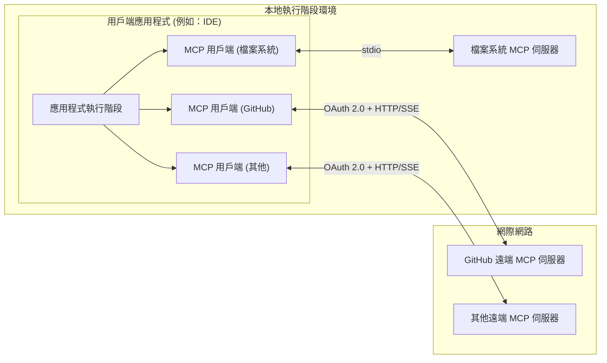
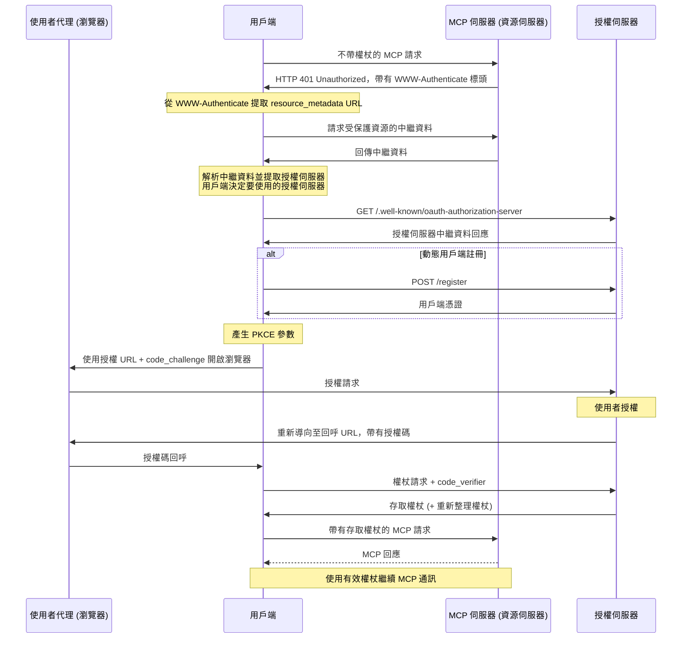

# 面向 MCP 主機作者的 GitHub 遠端 MCP 整合指南

本指南概述了希望允許安裝遠端 GitHub MCP 伺服器的 MCP 主機 (Host) 作者的高階考量因素。

目標是從高階角度解釋架構，定義關鍵要求，並提供引導您開始的指南，同時指向官方文件以獲取更深入的實作細節。

---

## 目錄

- [理解 MCP 架構](#理解-mcp-架構)
- [連接到遠端 GitHub MCP 伺服器](#連接到遠端-github-mcp-伺服器)
  - [身分驗證與授權](#身分驗證與授權)
  - [GitHub 上的 OAuth 支援](#github-上的-oauth-支援)
  - [使用 GitHub UI 建立啟用 OAuth 的應用程式](#使用-github-ui-建立啟用-oauth-的應用程式)
  - [需要考慮的事項](#需要考慮的事項)
  - [從您的用戶端應用程式發起 OAuth 流程](#從您的用戶端應用程式發起-oauth-流程)
- [處理組織存取限制](#處理組織存取限制)
- [基本安全考量](#基本安全考量)
- [其他資源](#其他資源)

---

## 理解 MCP 架構

模型上下文協定 (Model Context Protocol, MCP) 透過 [MCP 標準](https://modelcontextprotocol.io/) 定義的架構，實現您的應用程式與各種外部工具之間的無縫通訊。

### 高階架構

下圖說明了單個用戶端應用程式如何連接到多個 MCP 伺服器，每個伺服器都提供對一組唯一資源的存取。請注意，某些 MCP 伺服器在本地運行（與用戶端應用程式並排），而其他伺服器則是遠端託管的。GitHub 的 MCP 產品可以本地或遠端運行。

### 執行階段環境

- **應用程式 (Application)**：您正在建構的面向使用者的應用程式。它實例化一個或多個 MCP 用戶端並協調工具呼叫。
- **MCP 用戶端 (MCP Client)**：用戶端應用程式中的一個組件，與單個 MCP 伺服器保持 1:1 的連接。
- **MCP 伺服器 (MCP Server)**：提供對特定工具集存取的服務。
  - **本地 MCP 伺服器**：在本地運行的 MCP 伺服器，與應用程式並排運行。
  - **遠端 MCP 伺服器**：遠端運行的 MCP 伺服器，透過網際網路存取。大多數遠端 MCP 伺服器需要透過 OAuth 進行身分驗證。

有關更多詳細資訊，請參閱 [官方 MCP 規範](https://modelcontextprotocol.io/specification/2025-06-18)。

> [!NOTE]
> GitHub 同時提供本地 MCP 伺服器和遠端 MCP 伺服器。

---

## 連接到遠端 GitHub MCP 伺服器

### 身分驗證與授權

GitHub MCP 伺服器在 `Authorization` 標頭中需要一個有效的存取權杖 (access token)。這對於本地 GitHub MCP 伺服器和遠端 GitHub MCP 伺服器都是如此。

對於遠端 GitHub MCP 伺服器，獲取有效存取權杖的推薦方法是確保您的用戶端應用程式支援 [OAuth 2.1](https://datatracker.ietf.org/doc/html/draft-ietf-oauth-v2-1-13)。但應注意，您也可以提供任何有效的存取權杖。例如，您可以提供預先產生的個人存取權杖 (PAT)。

> [!IMPORTANT]
> 遠端 GitHub MCP 伺服器本身不提供身分驗證服務。
> 您的用戶端應用程式必須透過受支援的方法之一獲取有效的 GitHub 存取權杖。

[MCP 規範](https://modelcontextprotocol.io/specification/2025-06-18/basic/authorization#authorization-flow-steps) 中描述了透過 OAuth 獲取有效存取權杖的預期流程。為了方便起見，我們在下方嵌入了授權流程的副本。請仔細研究，因為本文檔的其餘部分是基於此流程編寫的。

> [!NOTE]
> 遠端 GitHub MCP 伺服器目前不支援動態用戶端註冊 (Dynamic Client Registration)。

#### GitHub 上的 OAuth 支援

GitHub 提供兩種透過 OAuth 獲取存取權杖的解決方案：[**GitHub Apps**](https://docs.github.com/en/apps/using-github-apps/about-using-github-apps#about-github-apps) 和 [**OAuth Apps**](https://docs.github.com/en/apps/oauth-apps)。這些解決方案通常由 GitHub 組織管理員建立、管理和維護。請與 GitHub 組織管理員合作配置 **GitHub App** 或 **OAuth App**，以允許您的用戶端應用程式利用 GitHub 的 OAuth 支援。此外，請注意，用戶端應用程式的使用者可能需要在其自己的 GitHub 組織中註冊您的 **GitHub App** 或 **OAuth App**，以便產生能夠存取組織 GitHub 資源的授權權杖。

> [!TIP]
> 在繼續之前，請檢查您的組織是否已經支援其中一種解決方案。您的 GitHub 組織管理員可以幫助您確定已註冊哪些 **GitHub Apps** 或 **OAuth Apps**。如果現有的 **GitHub App** 或 **OAuth App** 符合您的使用案例，請考慮重新將其用於遠端 MCP 授權。即便如此，請務必注意以下警告。

> [!WARNING]
> **GitHub Apps** 和 **OAuth Apps** 都要求用戶端應用程式傳遞「用戶端金鑰 (client secret)」以啟動 OAuth 流程。如果您的用戶端應用程式設計為在不受控環境中運行（即客戶提供的硬體），終端使用者將能夠發現您的「用戶端金鑰」並可能將其用於其他目的。在這種情況下，我們的建議是註冊一個專門用於處理來自用戶端應用程式的 OAuth 請求的新 **GitHub App** (或 **OAuth App**)。

#### 使用 GitHub UI 建立啟用 OAuth 的應用程式

有關建立 **GitHub App** 的詳細說明，請參閱 ["Creating GitHub Apps"](https://docs.github.com/en/apps/creating-github-apps/about-creating-github-apps/about-creating-github-apps#building-a-github-app)。（推薦） 
有關建立 **OAuth App** 的詳細說明，請參閱 ["Creating an OAuth App"](https://docs.github.com/en/apps/oauth-apps/building-oauth-apps/creating-an-oauth-app)。

有關選擇哪種類型的應用程式的指導，請參閱 ["Differences Between GitHub Apps and OAuth Apps"](https://docs.github.com/en/apps/oauth-apps/building-oauth-apps/differences-between-github-apps-and-oauth-apps)。

#### 需要考慮的事項：
- **GitHub Apps** 提供的權杖通常更安全，因為它們：
  - 包含過期時間
  - 支援細粒度權限
- **GitHub Apps** 必須先安裝在 GitHub 組織中才能使用。 通常，安裝必須由組織中具有管理員權限的人員核准。有關更多詳細資訊，請參閱 [此說明](https://docs.github.com/en/apps/oauth-apps/building-oauth-apps/differences-between-github-apps-and-oauth-apps#who-can-install-github-apps-and-authorize-oauth-apps)。 相比之下，**OAuth Apps** 不需要安裝，通常可以立即使用。
- 組織成員可以使用 GitHub UI [請求在整個組織範圍內安裝 GitHub App](https://docs.github.com/en/apps/using-github-apps/requesting-a-github-app-from-your-organization-owner)。
- 雖然並非絕對必要，但如果您預期會有廣泛的使用者使用您的 MCP 伺服器，請考慮在 [GitHub App Marketplace](https://github.com/marketplace?type=apps) 上發佈其對應的 **GitHub App** 或 **OAuth App**，以確保您的受眾可以發現它。

#### 從您的用戶端應用程式發起 OAuth 流程

對於 **GitHub Apps**，從用戶端應用程式啟動 OAuth 流程的詳細資訊請參見 [此處](https://docs.github.com/en/apps/creating-github-apps/authenticating-with-a-github-app/generating-a-user-access-token-for-a-github-app#using-the-web-application-flow-to-generate-a-user-access-token)。

對於 **OAuth Apps**，從用戶端應用程式啟動 OAuth 流程的詳細資訊請參見 [此處](https://docs.github.com/en/apps/oauth-apps/building-oauth-apps/authorizing-oauth-apps#web-application-flow)。

> [!IMPORTANT]
> 對於端點探索，請務必遵循由遠端 GitHub MCP 伺服器 [提供的 `WWW-Authenticate` 資訊](https://modelcontextprotocol.io/specification/draft/basic/authorization#authorization-server-location)，而不是依賴硬編碼的端點，如 `https://github.com/login/oauth/authorize`。

### 處理組織存取限制
組織可能會封鎖 **GitHub Apps** 和 **OAuth Apps**，直到明確獲得核准。在您的用戶端應用程式代碼中，如果由於您的 **GitHub App** 或 **OAuth App** 不可用（即未在使用者組織中註冊）而導致 OAuth 相關呼叫失敗，您可以提供可操作的後續步驟以獲得流暢的使用者體驗。

1. 偵測特定錯誤。
2. 清晰地通知使用者。
3. 根據他們的 GitHub 組織權限：
    - 組織成員：提示他們向 GitHub 組織管理員請求核准，存取未獲核准的組織。
    - 組織管理員：引導他們前往對應 GitHub 組織的應用程式核准設定頁面，網址為 `https://github.com/organizations/[ORG_NAME]/settings/oauth_application_policy`

## 基本安全考量
- **權杖儲存**：使用安全的平台 API（例如 Node.js 的 keytar）。
- **輸入驗證**：清理所有工具參數。
- **僅限 HTTPS**：切勿透過純文字 HTTP 發送請求。在生產環境中始終使用 HTTPS。
- **PKCE**：我們強烈建議為所有 OAuth 流程實作 [PKCE](https://datatracker.ietf.org/doc/html/rfc7636)，以防止代碼攔截，並為即將推出的 PKCE 支援做準備。

## 其他資源
- [MCP 官方規範](https://modelcontextprotocol.io/specification/draft)
- [MCP SDKs](https://modelcontextprotocol.io/sdk/java/mcp-overview)
- [關於建立 GitHub Apps 的 GitHub 文件](https://docs.github.com/en/apps/creating-github-apps)
- [關於使用 GitHub Apps 的 GitHub 文件](https://docs.github.com/en/apps/using-github-apps/about-using-github-apps)
- [關於建立 OAuth Apps 的 GitHub 文件](https://docs.github.com/en/apps/oauth-apps)
- 有關將 OAuth Apps 安裝到 [個人帳戶](https://docs.github.com/en/apps/oauth-apps/using-oauth-apps/installing-an-oauth-app-in-your-personal-account) 和 [組織](https://docs.github.com/en/apps/oauth-apps/using-oauth-apps/installing-an-oauth-app-in-your-organization) 的 GitHub 文件
- [在組織級別管理 OAuth Apps](https://docs.github.com/en/organizations/managing-oauth-access-to-your-organizations-data)
- [在 GitHub 組織級別管理程式化存取](https://docs.github.com/en/organizations/managing-programmatic-access-to-your-organization)
- [建構 Copilot 擴充功能](https://docs.github.com/en/copilot/building-copilot-extensions)
- [管理應用程式/擴充功能的能見度](https://docs.github.com/en/copilot/building-copilot-extensions/managing-the-availability-of-your-copilot-extension) (包括 GitHub Marketplace 資訊)
- [VS Code 存儲庫中的實作範例](https://github.com/microsoft/vscode/blob/main/src/vs/workbench/api/common/extHostMcp.ts#L313)
